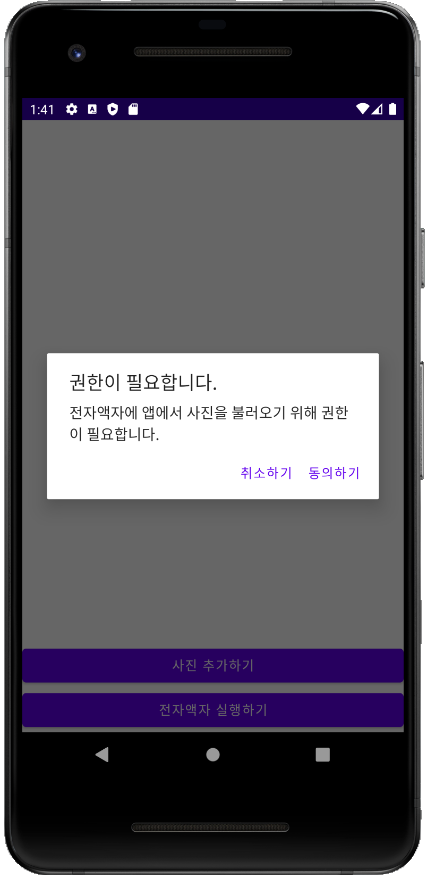
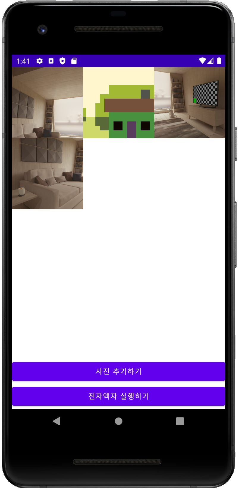
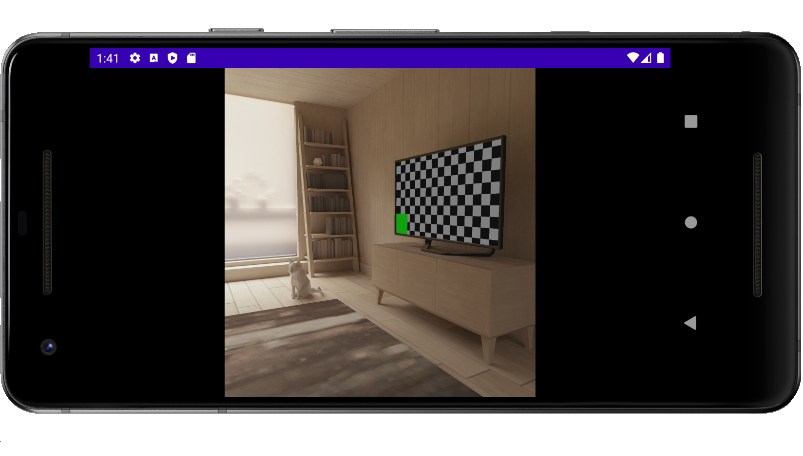

# 전자액자만들기

저장소 접근 권한을 이용하여 로컬 사진을 로드 할 수 있음.

추가한 사진들을 일정한 간격(시간)으로 전환하여 보여줄 수 있음.

# 사용한 기술

- **Layout** 을 그리는 법
  - 가로 화면으로 그리기
- **Android Permission** 사용하기
- **View Animation** 사용하기
- **Activity Lifecycle** 알아보기
- Content Provider
  - SAF (Storage Access Framework)

# 결과화면

